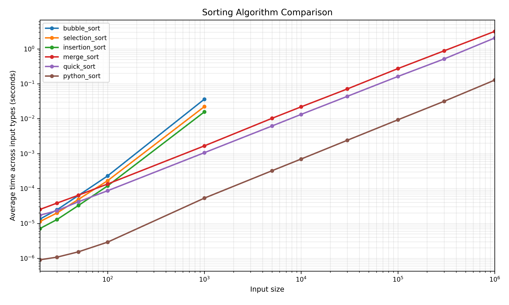
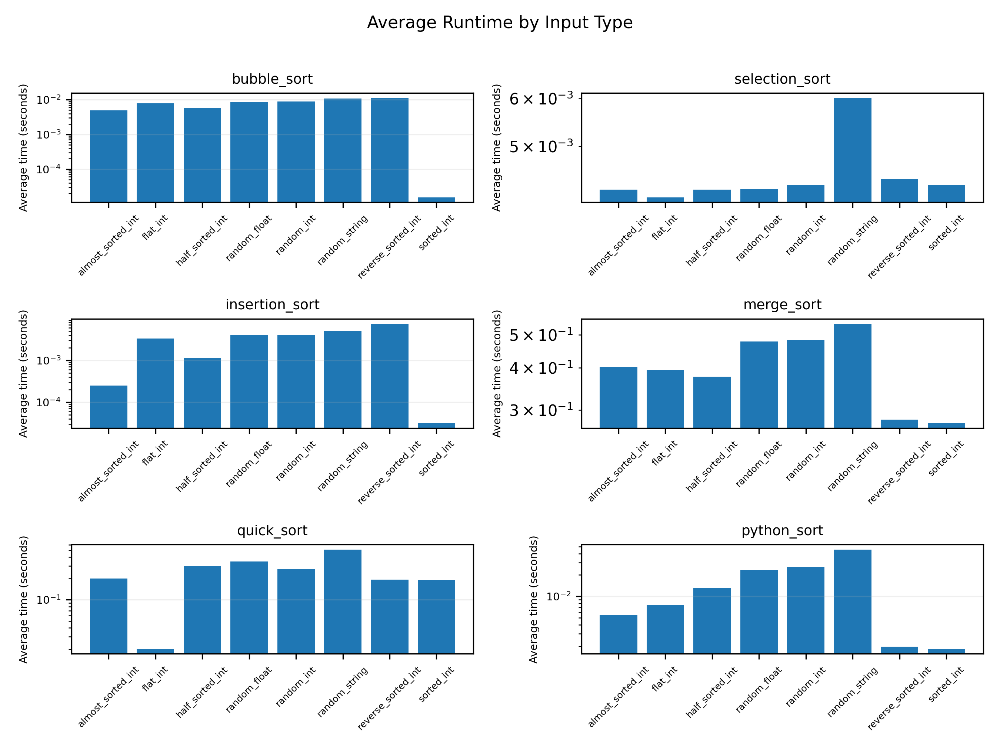
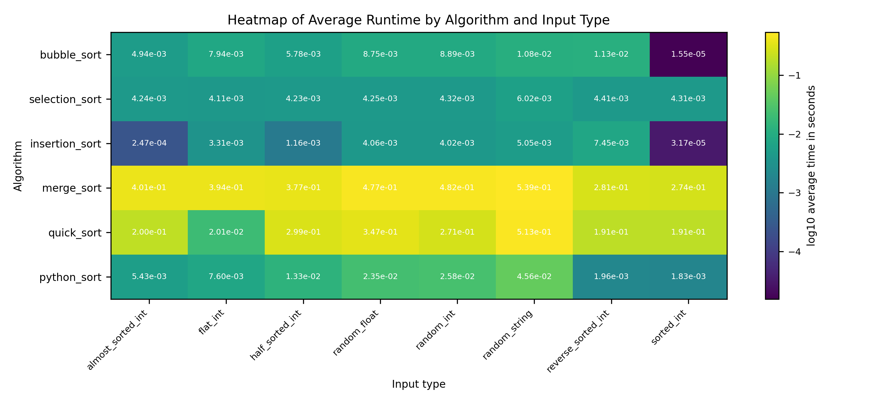

# Python Sorting Algorithm Runtime Benchmark

This project compares the runtime performance of several sorting algorithms implemented in Python.

The goal is to observe how simple sorting algorithms behave compared to more efficient algorithms when they are tested on different input sizes and input types.

The project generates datasets, runs each algorithm, checks that the results are correct, saves the runtime measurements, and creates graphs that make the performance differences easier to understand.

## Algorithms Compared

The project compares the following sorting algorithms:

* Bubble Sort
* Selection Sort
* Insertion Sort
* Merge Sort
* Quick Sort
* Heap Sort
* Shell Sort
* Python built-in sort

## Project Purpose

Sorting is one of the basic problems in computer science. It is used in searching, ranking, indexing, scheduling, database processing, and data analysis.

This project does not only look at theoretical complexity. It also measures how the algorithms behave in practice when implemented in Python.

The main questions are:

1. Do the measured runtimes match the expected theoretical behavior?
2. How does input type affect sorting performance?
3. How much faster is Python's built-in sort compared to manually implemented algorithms?

## Input Types

The benchmark uses several generated input types:

* random integers
* random floating-point numbers
* random strings
* sorted integers
* reverse-sorted integers
* almost-sorted integers
* half-sorted integers
* flat lists with repeated values

This matters because sorting performance depends not only on input size, but also on the structure of the data.

## Results

### Figure 1: Overall Runtime Comparison



This graph compares the average runtime of the algorithms across different input sizes.

The simple quadratic algorithms, such as Bubble Sort, Selection Sort, and Insertion Sort, become slow quickly as the input size increases.

The more efficient algorithms scale better, especially Quick Sort, Merge Sort, Heap Sort, Shell Sort, and Python's built-in sort.

Python's built-in sort performs best overall because it is highly optimized.

## Figure 2: Average Runtime by Input Type



This figure shows that input structure affects runtime.

Insertion Sort performs very well on sorted and almost-sorted data because it can take advantage of existing order.

Selection Sort is more stable across input types because it performs a similar number of comparisons regardless of how the input is arranged.

Python's built-in sort also benefits from already ordered or partially ordered input data.

## Figure 3: Runtime Heatmap



The heatmap gives a compact view of the average runtime by algorithm and input type.

Darker cells show faster runtimes.

Lighter cells show slower runtimes.

The heatmap makes it easier to see which algorithm and input-type combinations are faster or slower.

## Main Findings

The benchmark confirms the expected difference between simple quadratic algorithms and more efficient sorting algorithms.

Bubble Sort, Selection Sort, and Insertion Sort are useful for learning because they are easy to understand. However, they do not scale well to large inputs.

Merge Sort, Quick Sort, Heap Sort, and Shell Sort handle larger inputs better.

Python's built-in sort is the strongest practical choice in this project. It is faster than the manual implementations because it is optimized and can take advantage of existing order in the data.

The results also show that Big O notation is not the whole story. Runtime also depends on input type, implementation details, and the testing environment.

## Project Structure

```text
sorting_pr/
├── graphics/
│   ├── figure_2_overall_runtime_comparison.png
│   ├── figure_3_average_runtime_by_input_type.png
│   └── figure_4_average_runtime_heatmap.png
├── src/
│   └── source files
├── data/
│   └── generated or stored data
├── README.md
├── requirements.txt
└── .env
```

A fuller benchmark version may include these files:

```text
generate_data.py          creates reusable datasets
sorting_algorithms.py     contains the sorting algorithms
benchmark.py              runs timing and correctness checks
analyze_results.py        summarizes the raw benchmark data
make_graphics.py          creates the result figures
check_requirements.py     checks project coverage
```

## How to Run the Project

Clone the repository:

```bash
git clone https://github.com/andreitegzes06-ui/sorting_pr.git
cd sorting_pr
```

Install the required packages:

```bash
pip install -r requirements.txt
```

Run the project:

```bash
python src/main.py
```

If the project uses separate benchmark scripts, run:

```bash
python generate_data.py
python benchmark.py
python analyze_results.py
python make_graphics.py
```

## Correctness Checking

Each algorithm is checked against Python's built-in `sorted()` function.

For every input list, the benchmark compares the custom algorithm output with:

```python
sorted(input_list)
```

This makes sure that each algorithm is correct, not only fast.

## Limitations

The results describe this specific Python implementation and this testing setup.

They should not be treated as a universal ranking of all sorting algorithm implementations.

Some slower algorithms were tested only on smaller input sizes because they become too slow for very large lists.

The benchmark mainly measures runtime. It does not fully measure memory usage, number of comparisons, or number of swaps.

## Future Improvements

Possible improvements include:

* repeating more tests
* reporting standard deviation
* counting comparisons and swaps
* testing more Quick Sort pivot strategies
* testing different Shell Sort gap sequences
* saving Python version and machine information
* using more real-world datasets
* improving the visual design of the graphs

## Paper

This repository is connected to the paper:

**Comparing Sorting Algorithms in Python**

The paper explains the formal sorting problem, the algorithms, the benchmark design, the experimental results, limitations, and future work.

## Author

**Andrei Tegzes**
Department of Computer Science
West University of Timișoara
